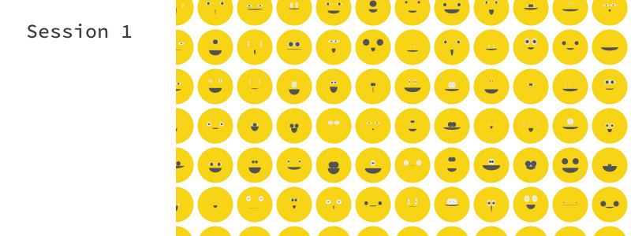
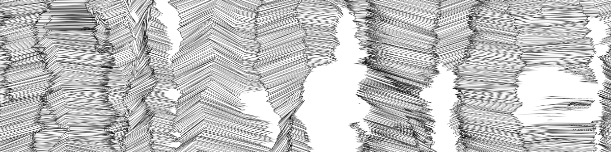
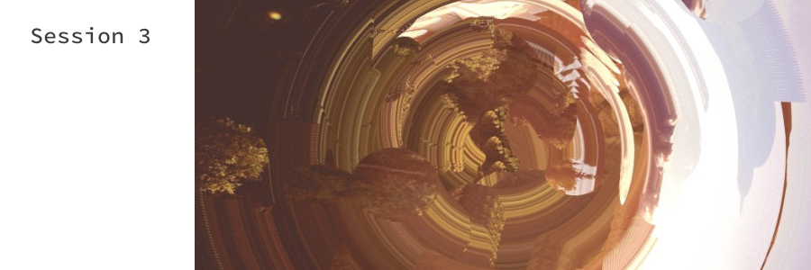

# coding-sessions

This repository documents code examples from *creative coding sessions* in the Atelier Rechbauerstraße 46. All of the examples are created using the Processing integrated development editor in various modes. In this sessions we explore how simple programs can produce complex visual output. For the most of the examples we use Processing as a *flexible software sketchbook* and *language* for learning how to code within the context of *the visual arts*.

## Session 1 – "Smiles"

- Installing the IDE
- Basics of drawing shapes
- Creating variables

## Session 2 – "Moving lines"

- More advanced shapes
- Creating a list of variables
- Modifying the list over time

## Session 3 – "Pixel glitch"

- Loading and manipulating images
- Overlay, Blend and Mask images
- Get colors of images per pixel