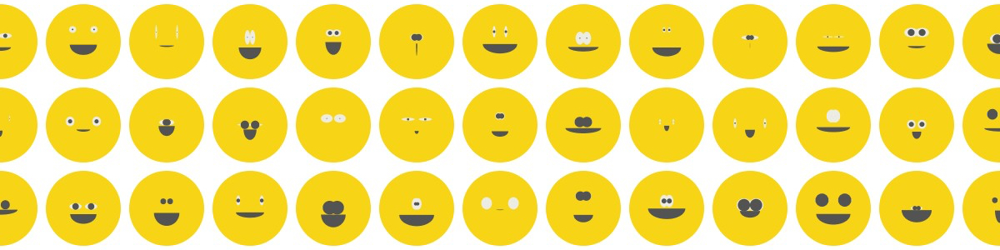

# coding-sessions
Preps and docs for my creative coding sessions in the atelier

## Working with the Processing IDE
> Processing is a flexible software sketchbook and a language for learning how to code within the context of the visual arts. Since 2001, Processing has promoted software literacy within the visual arts and visual literacy within technology. There are tens of thousands of students, artists, designers, researchers, and hobbyists who use Processing for learning and prototyping.

## Setting up a basic Processing sketchbook
Head over to https://processing.org/ and download the IDE (Integrated Development Editor) for Processing. They offer installers for Windows, Mac and Linux systems. The install will create a folder called ``Processing`` in your user directory. In this place we will # coding-sessions
Preps and docs for my creative coding sessions in the atelier

# Getting started

## Working with the Processing IDE
Processing is a flexible software sketchbook and a language for learning how to code within the context of the visual arts. Since 2001, Processing has promoted software literacy within the visual arts and visual literacy within technology. There are tens of thousands of students, artists, designers, researchers, and hobbyists who use Processing for learning and prototyping.
Head over to https://processing.org/ and download the IDE (Integrated Development Editor) for Processing. They offer installers for Windows, Mac and Linux systems. The install will create a folder called ``Processing`` in your user directory. In this place we will create little programs that we call "sketches". These sketches can be written in Processings default language Java (Version 8.0), JavaScript, Python and many more.

## Session 1 – "Miles smiles"
– Installing the IDE
– Basics of drawing shapes
– Creating variables

## Session 2 – "Floating lines"
– More advanced shapes
– Creating a list of variables
– Modifying the list over time

## Session 3 – "Pixel glitch"
– Loading and manipulating images
– Overlay, Blend and Mask images
– Get colors of images per pixel
 little programs that we call "sketches".