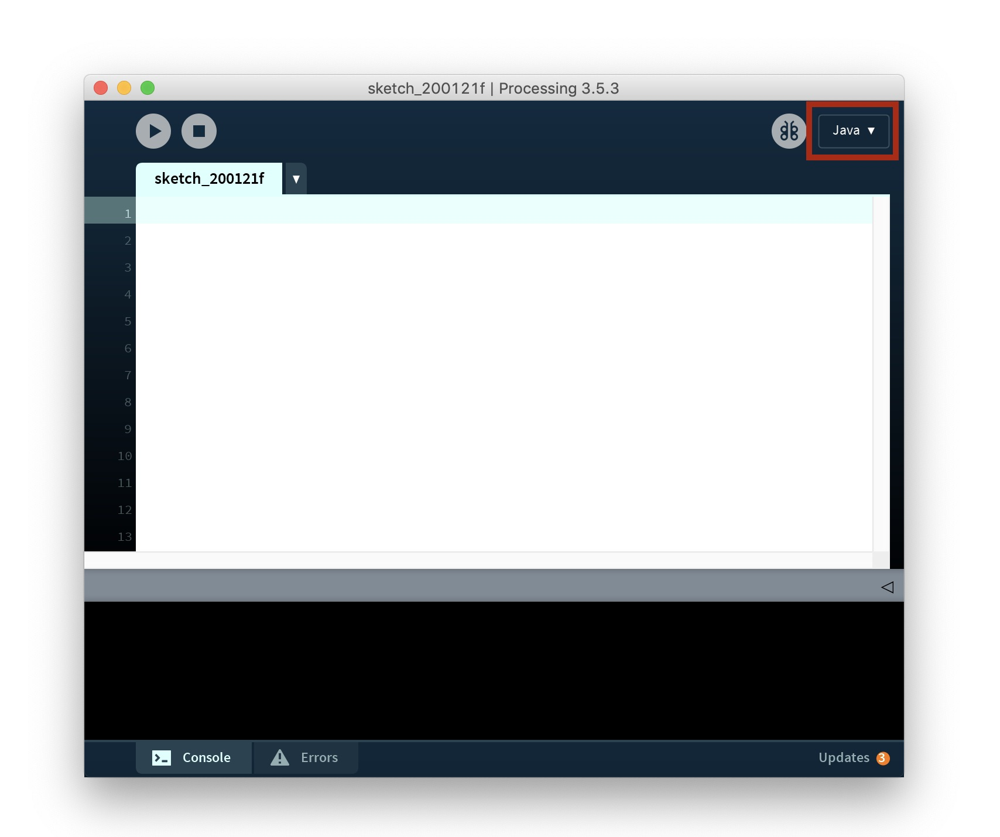
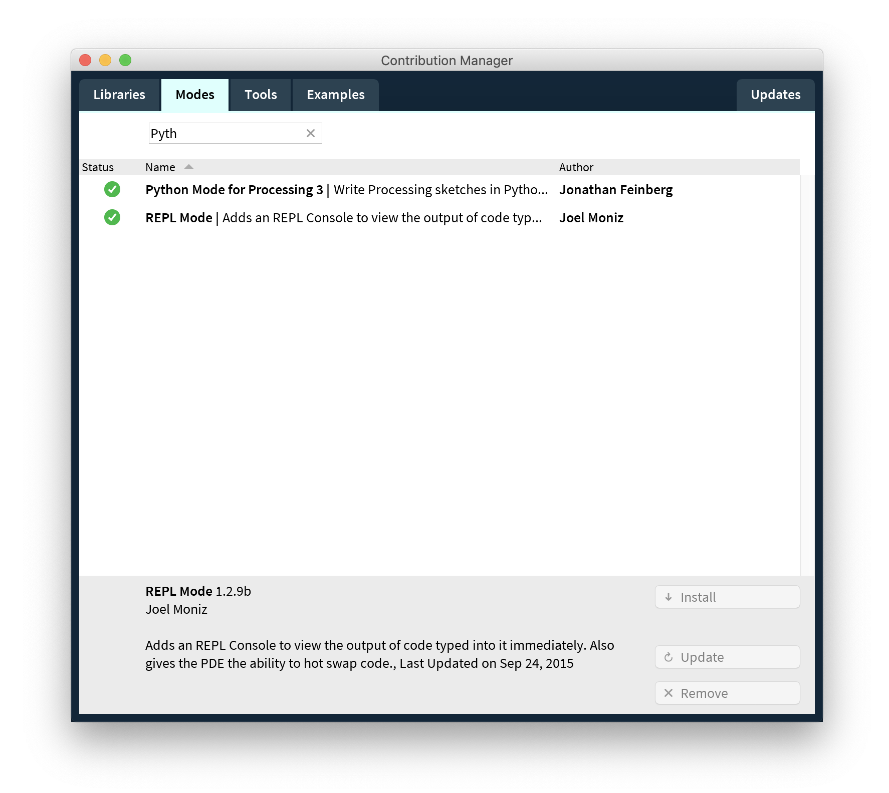

# Getting started

### Install the Processing IDE
- Go to https://processing.org/download/ and download the installer
- Pick your system: they offer installers for Windows, Mac and Linux systems.
- The install will create a folder called ``Processing`` in your user directory
- All of our processing programs will should be stored in a ``sketches`` directory

### Install the Python Mode

- Click the language selection dropdown and choose ``Add mode``

- Pick 'Python Mode for Processing 3' and click 'Install'

### Install the Python Programming language on your system
- Head over to https://www.python.org/downloads/ and download the latest version

- Win: ``type nul >> your_file.txt``
- Mac: ``touch file.txt``
- Win: ``l``
- Mac: ``touch file.txt``