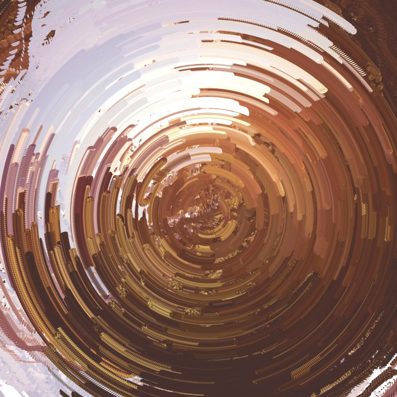

# RotationDraw.pyde

This example is using Processing's python mode, graphics buffers, alpha masks and a jpg image to create a bold and colorful visual on the screen, that can be saved as a file. 

# Idea of the program
The program loads the pixels of a given image into a graphics buffer, then applies an alpha mask with a large number of randomly placed white shapes on a black background, leaving only parts of the original image visible. Not calling ``background(255)`` inside of the draw loop traces a colorful path around the mouse position.

## Learning goals
- Learn to load, resize and display images in Processing 
- Learn to create graphics buffers and apply alpha masks 
- Learn to animate the masked image in draw
- Learn save the images you draw 
