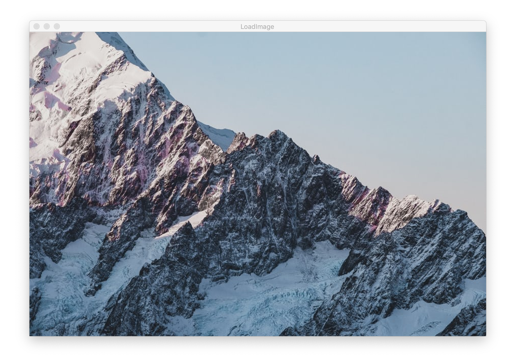
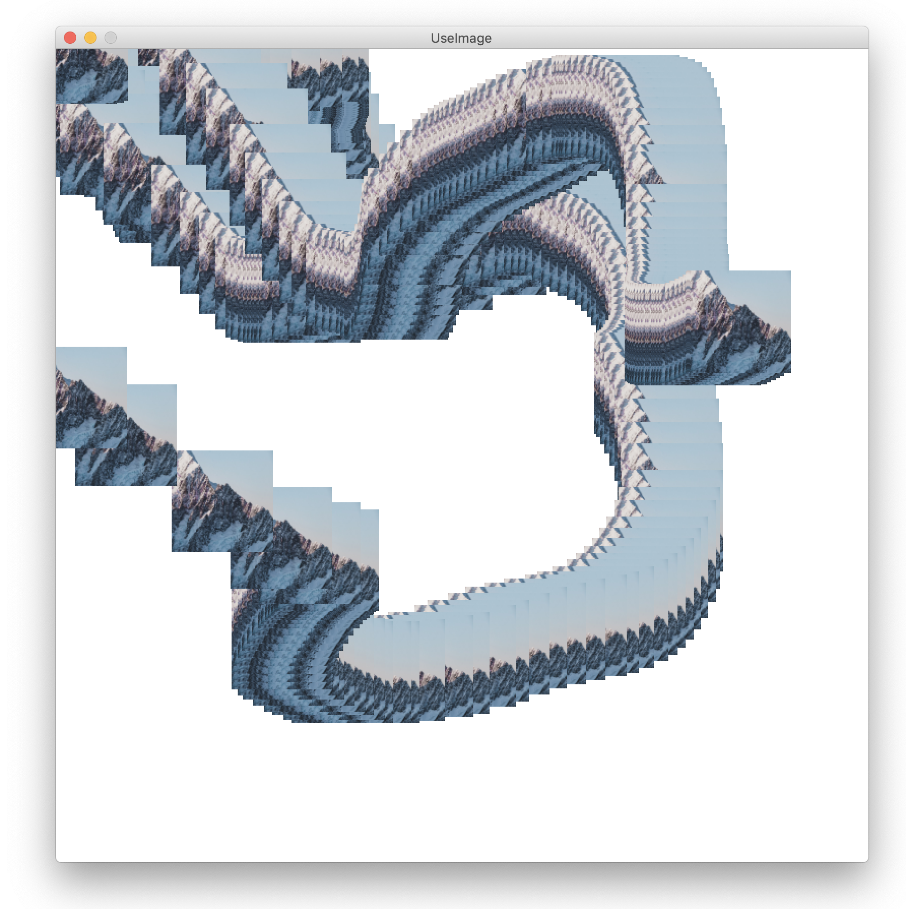
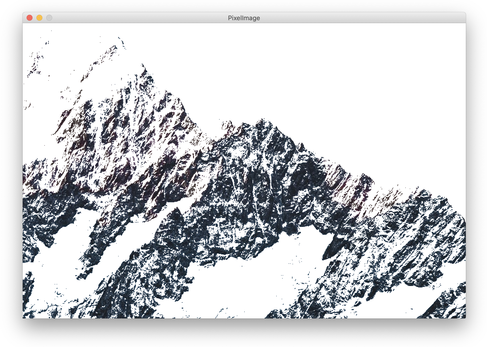

# Working with Processing's python mode


### Numbers
```python
# You can print a number
print(10)

# You can add numbers
print(10 + 10)

# You can subtract numbers
print(10 - 10)

# You can do multiplications
print(10 * 10)

# You can do divisions
print(10 / 10)

# You even can do divisions, but here we first notice the difference between integer and float numbers
print(1 / 10.0) # 0.1
print(1 / float(10)) # 0.1 converted to floating point number
print(1 / 10) # 0
```

### Text
```python
# You can also print text (string)
print("Hello World")

# You can add strings together
print("Puff" + " " + "Daddy")

# You can not subtract or divide strings
# TypeError > print("Hello" - "  World")
# TypeError > print("Hello" / "  World")

# You can however multiply strings with integer numbers
print(" :) " * 10)
#  :)  :)  :)  :)  :)  :)  :)  :)  :)  :)
```

### Variables ...
```python
# You can give names to to stored numbers or texts
a = 10
print(a)

# You can modify the stored number
a = a + 1
print(a)


```


# Basics of images

### Loading and displaying an image

```python
 def setup():

    # Set to the same size as the source image
    # https://unsplash.com/photos/mGy1Jjr2e6M
    size(900, 600)

    # Load and display and position the image
    image(loadImage("file.jpg"), 0, 0)
```


### Resize, store and use the image
```python
# Globally stored image
myImage = None

def setup():

    # Import the image
    global myImage

    # Define the sketch format
    size(900, 600)

    # Set the origin of the image to it's center
    imageMode(CENTER)

    # Load the source image
    # https://unsplash.com/photos/mGy1Jjr2e6M
    myImage = loadImage("file.jpg")

    # Skew the image to a small square
    myImage.resize(100, 100)

    # Clear screen with white
    background(255)

def draw():

    # Attach the square to the mouse position
    image(myImage, mouseX, mouseY)
```



### Working with pixels of an image

```python
def setup():

    # Set to the same size as the source image
    # https://unsplash.com/photos/mGy1Jjr2e6M
    size(900, 600)

    background(255)

    # Load the image pixels
    img = loadImage("file.jpg")
    img.loadPixels()

    # Draw the image pixels to the canvas
    loadPixels()
    for x in range(width):
        for y in range(height):

            # Calculate index in pixels array
            index = x + y * width

            # Get the color from the source image
            current = img.get(x, y)

            # Custom exposure
            if (brightness(current) < 100):
                pixels[index] = current
    updatePixels()
```

