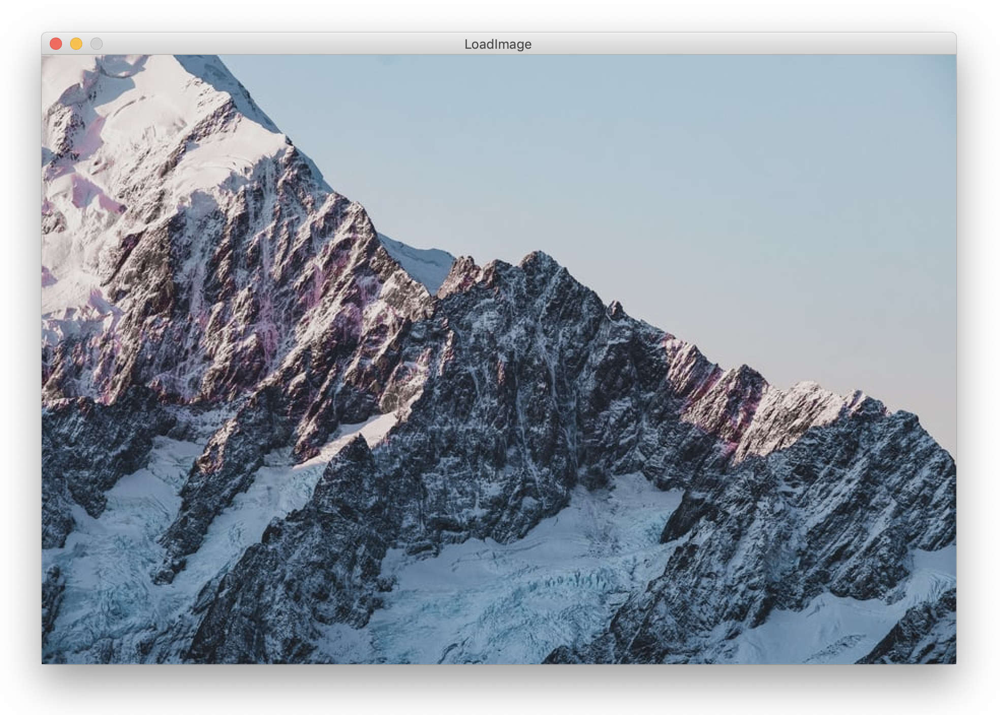

# Working with Processing's python mode


### Numbers ... 
```python
# You can print a number
print(10)
# >>>10

# You can store a number, then print it
a = 10
print(a)
# >>>10

# You can increase the number by 1
a = a + 1
print(a)
# >>>11
 
```

### Numbers ... 
```python
# 
```

# Basics of images

### Loading and displaying an image


```python
 def setup():

    # Set to the same size as the source image
    # https://unsplash.com/photos/mGy1Jjr2e6M
    size(900, 600)

    # Load and display and position the image
    image(loadImage("file.jpg"), 0, 0)
```

### Resize, store and use the image

```python
# Globally stored image
myImage = None

def setup():

    # Import the image
    global myImage

    # Define the sketch format
    size(900, 600)

    # Set the origin of the image to it's center
    imageMode(CENTER)

    # Load the source image
    # https://unsplash.com/photos/mGy1Jjr2e6M
    myImage = loadImage("file.jpg")

    # Skew the image to a small square
    myImage.resize(100, 100)

    # Clear screen with white
    background(255)

def draw():

    # Attach the square to the mouse position
    image(myImage, mouseX, mouseY)
```

### Working with pixels of an image


```python
def setup():

    # Set to the same size as the source image
    # https://unsplash.com/photos/mGy1Jjr2e6M
    size(900, 600)

    background(255)

    # Load the image pixels
    img = loadImage("file.jpg")
    img.loadPixels()

    # Draw the image pixels to the canvas
    loadPixels()
    for x in range(width):
        for y in range(height):

            # Calculate index in pixels array
            index = x + y * width

            # Get the color from the source image
            current = img.get(x, y)

            # Custom exposure
            if (brightness(current) < 100):
                pixels[index] = current
    updatePixels()
```
