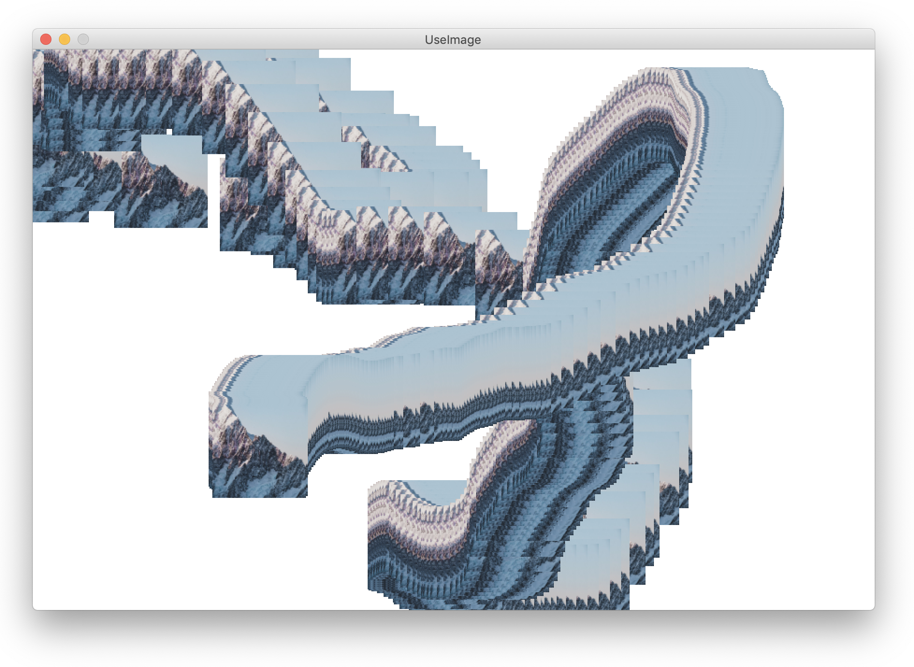

# Basic operations with images in Processing

### Loading and displaying an image


```python
 def setup():

    # Set to the same size as the source image
    # https://unsplash.com/photos/mGy1Jjr2e6M
    size(900, 600)

    # Load and display and position the image
    image(loadImage("file.jpg"), 0, 0)
```

### Resize, store and use the image

```python
# Globally stored image
myImage = None

def setup():

    # Import the image
    global myImage
    # Define the sketch format
    size(800, 800)
    # Load and resize the image
    myImage = loadImage("file.jpg")
    myImage.resize(100, 100)
    # Set to the same size as the source image
    # https://unsplash.com/photos/mGy1Jjr2e6M

def draw():

    # Attach the image to the mouse position
    image(myImage, mouseX, mouseY)

```

### Working with pixels of an image
```python
def setup():
  size(800, 800)
  image(loadImage("file.jpg"), 0, 0)
```
